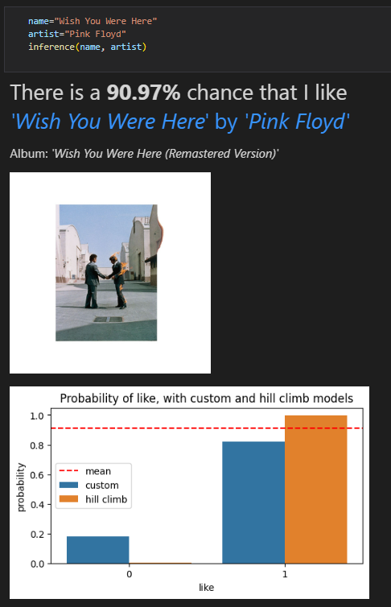

### Analizing liked songs features from Spotify, using Bayesian networks 
Modern streaming platforms are known for their ability to predict the preferences of their users. The music industry in particular poses a complex challenge due to the vastness of different music genres and songs available. 
This project aims to model a Bayesian Network from a dataset built by fetching Spotify's API personal data and to experiment with different queries and methods in order to find interesting relationships. Finally, a use case scenario with the final model is presented.

The most relevant files are:
- [Dataset.ipynb](Dataset.ipynb): notebook that generates the dataset, with all the explanations on how data was processed, and the reasons behind each choice.
- [Bayesify.ipynb](Bayesify.ipynb): main notebook where the models are built, and all the experiments performed.
- [spotifyData.csv](spotifyData.csv): the preprocessed dataset used for esimating the CPDs. 

## Libraries
- [Spotipy](https://github.com/spotipy-dev/spotipy) to retrieve all kinds of data regarding my liked pieces, and converting it in csv to be imported by Pandas.
- [Pgmpy](https://github.com/pgmpy/pgmpy) to make Bayesian networks and inferences.
- Numpy, Seaborn, Matplotlib and Pandas for data manipulation and visualization.

## Screenshot

## References
1. [Spotify's API](https://developer.spotify.com/documentation/web-api/reference/#/operations/get-several-audio-features)
2. [PGMpy Sampling source code](https://pgmpy.org/_modules/pgmpy/models/BayesianNetwork.html#BayesianNetwork.simulate)
3. [PGMpy rejection sampling source code](https://pgmpy.org/_modules/pgmpy/sampling/Sampling.html#BayesianModelSampling.rejection_sample)
