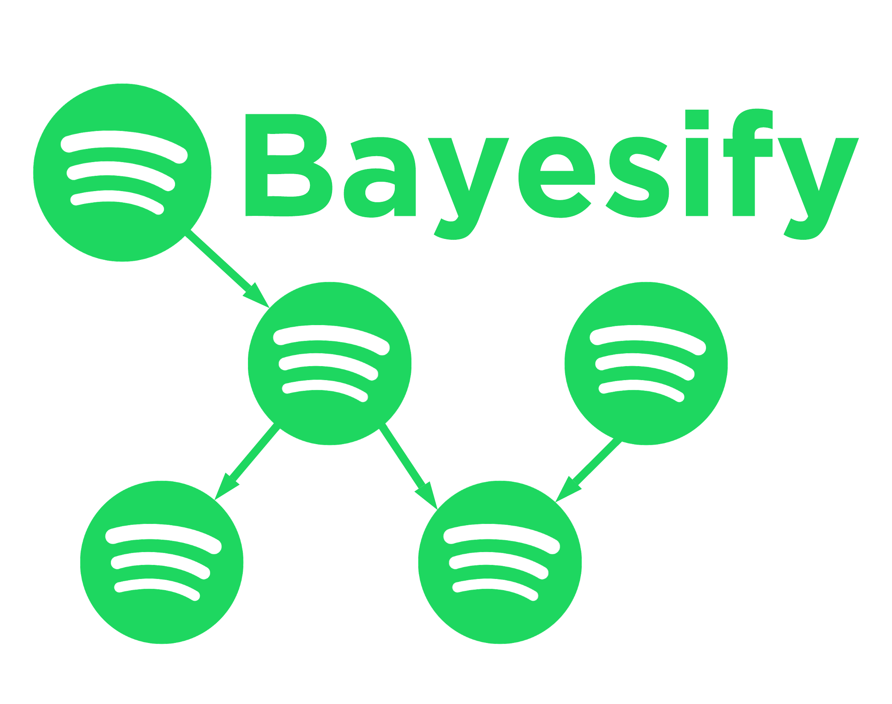

### Analizing liked songs features from Spotify, using Bayesian networks 
The project is divided in two parts:
- Making the Dataset (retrieving data from the API, cleaning it, adding Genere and Like features, discretizing values, ...)
- Making the model, analyzing it, trying different inference methods (main part of the project required by the exam)

## Libraries
- [Spotipy](https://github.com/spotipy-dev/spotipy) to retrieve all kinds of data regarding my liked pieces, and converting it in csv to be imported by Pandas.
- [Pgmpy](https://github.com/pgmpy/pgmpy) to make Bayesian networks and inferences.
- Numpy, Seaborn, Matplotlib and Pandas for data manipulation and visualization

## Screenshot

## References
- [Spotify's API](https://developer.spotify.com/documentation/web-api/reference/#/operations/get-several-audio-features)
